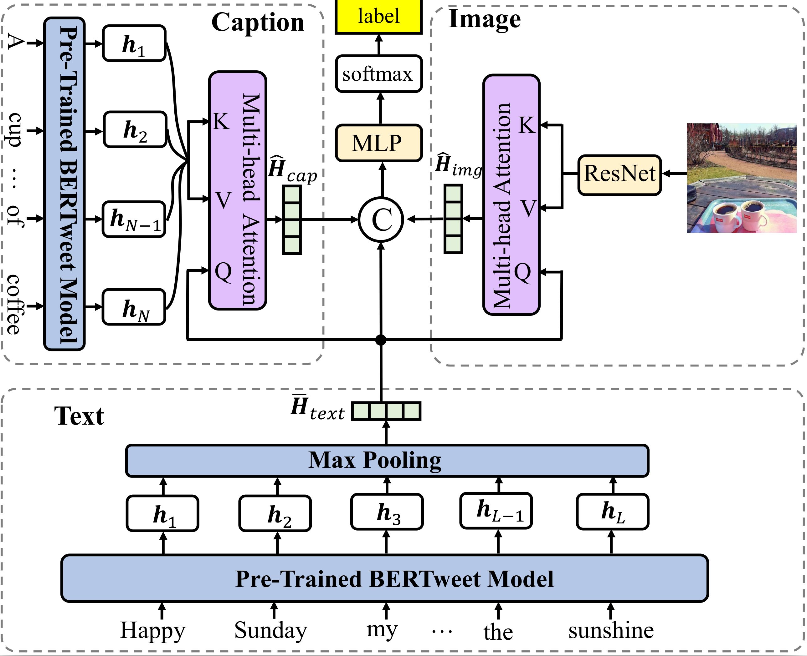

# Multimodal Discourse  
PyTorch Code for the following paper at EMNLP2022 findings:  
**Title**: Understanding Social Media Cross-Modality Discourse in Linguistic Space  
**Authors**: Chunpu Xu, Hanzhuo Tan, Jing Li, Piji Li \
**Institute**: PolyU and NUAA  
**Abstract**  
The multimedia communications with texts and images are popular on social media.
However, limited studies concern how images are structured with texts to form coherent meanings in human cognition.
To fill in the gap, we present a novel concept of cross-modality discourse, reflecting how human readers couple image and text understandings.
Text descriptions are first derived from images (named as subtitles) in the multimedia contexts. 
Five labels -- entity-level insertion, projection and concretization and scene-level restatement} and extension --- are further employed to shape the structure of subtitles and texts and present their joint meanings.
As a pilot study, we also build the very first dataset containing 16K multimedia tweets with manually annotated discourse labels.
The experimental results show that the multimedia encoder based on multi-head attention with captions is able to obtain the-state-of-the-art results.\
**Framework illustration**\


## Data
The annotated 16k multimedia tweets could be find from `data/social_text_all.json`, which contains the tweet texts, annotated labels and generated captions. For raw tweet image data, please find it from [here](https://connectpolyu-my.sharepoint.com/:u:/g/personal/21038672r_connect_polyu_hk/Ea2slzlxGOtIr-gfoYQkMGkBAe1B4TK4WCidjSfSuf3QiQ?e=9O4KBS). 
You can also download the extracted image features from [here](https://connectpolyu-my.sharepoint.com/:u:/g/personal/21038672r_connect_polyu_hk/Ec7pJDWJ8FRDkpzGrouFkAABiTxQ9Iknq4pWDsL_xj-m5A?e=Y8deeI).

## Installation
```
# Create environment
conda create -n multimodal_discourse  python==3.6
# Install pytorch 
conda install -n multimodal_discourse  -c pytorch pytorch==1.10.0 torchvision
```

## Training
```
python run_img_text_caption.py --img_feature_path final_dataset_features_att
```
We provide our pretrained models in [here](https://connectpolyu-my.sharepoint.com/:u:/g/personal/21038672r_connect_polyu_hk/EeI2cQ8dEtNFpHR4MD2f4HUBK3uk33xOrCl7NU1zvMCkIA?e=CJaye3)

# License
This project is licensed under the terms of the MIT license. 
